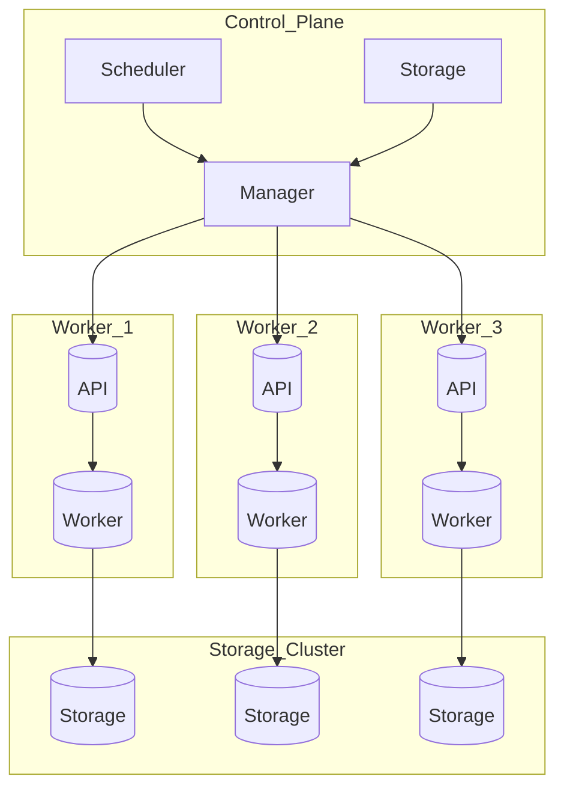

# Система оркестрации контейнеров

Проектная работа по созданию системы оркестрации Docker-контейнеров с поддержкой распределенного выполнения задач.

## Оглавление

- [Обзор](#обзор)
- [Архитектура](#архитектура)
- [Установка и настройка](#установка-и-настройка)
- [Компоненты системы](#компоненты-системы)
- [Интерфейс командной строки (CLI)](#интерфейс-командной-строки-cli)
- [Примеры использования](#примеры-использования)
- [Разработка и тестирование](#разработка-и-тестирование)
- [Планы по развитию](#планы-по-развитию)

---

## Обзор

Система оркестрации контейнеров представляет собой распределенную платформу для управления Docker-контейнерами, задачами и воркерами. Проект реализует базовые паттерны оркестрации, характерные для промышленных решений (Kubernetes, Docker Swarm), но в упрощенном виде для образовательных целей.

### Ключевые возможности

- **Управление контейнерами**: создание, запуск, остановка и удаление Docker-контейнеров
- **Система задач**: создание и отслеживание состояния задач
- **Воркеры**: распределенное выполнение задач
- **Менеджер**: балансировка нагрузки и управление воркерами
- **Планировщик**: определение лучшей машины для выполнения задачи
- **Ноды**: представление вычислительных узлов
- **CLI**: удобный интерфейс командной строки

### Технологии

- **Язык**: Rust
- **Контейнеризация**: Docker (через библиотеку Bollard)
- **Асинхронность**: Tokio
- **CLI парсер**: Clap
- **Уникальные идентификаторы**: UUID

---

## Архитектура

Система состоит из следующих основных компонентов:



### Компоненты

#### 1. **Task (Задача)**
Сущность, представляющая единицу работы. Содержит информацию об образе, ресурсах и состоянии выполнения.

#### 2. **Worker (Воркер)**
Исполнитель, который запускает и останавливает задачи, управляет контейнерами и собирает статистику.

#### 3. **Manager (Менеджер)**
Оркестратор, отвечающий за распределение задач между воркерами и мониторинг их состояния.

#### 4. **Scheduler (Планировщик)**
Планировщик определяет, какая машина лучше всего подходит для выполнения задач, определенных в задании. Процесс принятия решения может быть как простым, например, выбор узла из набора машин по принципу циклического распределения, так и сложным.

#### 5. **Storage (Хранилище)**
Хранение состояний задач

#### 6. **Node (Нода)**
Абстракция вычислительного узла с информацией о ресурсах (CPU, память, диск).

#### 7. **Docker Container**
Обертка над Docker API для управления контейнерами.


```
┌─────────────────────────────────────────────────────────┐
│                         CLI                             │
└─────────────────────────────────────────────────────────┘
                            │
                            ▼
┌─────────────────────────────────────────────────────────┐
│                      Manager                            │
│  - Управление воркерами                                 │
│  - Балансировка задач                                   │
│  - Мониторинг состояния                                 │
└─────────────────────────────────────────────────────────┘
                            │
                            ▼
┌─────────────────────────────────────────────────────────┐
│                      Scheduler                          │
│  - Определение набора машин-кандидатов, на которых      │
│    может выполняться задача                             │
│  - Оценка машины-кандидаты от лучшей к худшей           │
│  - Выброр машины с наилучшей оценкой                    │
└─────────────────────────────────────────────────────────┘
                            │
                            ▼
┌─────────────────────────────────────────────────────────┐
│                      Worker                             │
│  - Выполнение задач                                     │
│  - Управление контейнерами                              │
│  - Сбор статистики                                      │
└─────────────────────────────────────────────────────────┘
                            │
                            ▼
┌─────────────────────────────────────────────────────────┐
│                   Docker Container                      │
│  - Изоляция процессов                                   │
│  - Управление ресурсами                                 │
└─────────────────────────────────────────────────────────┘
```

---

## Установка и настройка

### Предварительные требования

- **Rust** (версия 1.95 или выше)
- **Docker** (версия 29.4 или выше)
- **Docker daemon** (должен быть запущен)

### Установка

1. Клонируйте репозиторий:
```bash
git clone https://github.com/chipset78/container-orchestrator.git
cd container-orchestrator
```

2. Соберите проект:
```bash
cargo build --release
```

3. Запустите тесты (опционально):
```bash
cargo test
```

### Конфигурация

Проект использует стандартные настройки Docker. Убедитесь, что Docker daemon запущен:

```bash
sudo systemctl start docker  # Linux
# или
docker info  # Проверка статуса
```

---

## Компоненты системы

### Модуль Task

```rust
let task = Task::new(
    Uuid::new_v4(),
    "My Task".to_string(),
    TaskState::Pending,
    "nginx:latest".to_string(),
    1024,  // память в MB
    10     // диск в GB
);
```

### Модуль Worker

```rust
let mut worker = Worker::new("worker-1".to_string());
worker.add_task(task);
worker.run_task().await;
worker.collect_stats().await;
```

### Модуль Manager

```rust
let mut manager = Manager::new();
manager.workers.push("worker-1".to_string());
manager.select_worker();
manager.send_work();
```

### Модуль Node

```rust
let node = Node::new(
    "node-1".to_string(),
    "192.168.1.100".to_string(),
    8,     // ядра
    16384, // память MB
    100,   // диск GB
    "worker".to_string()
);
```

---

## Интерфейс командной строки (CLI)

### Основные команды

| Команда       | Описание                       |
|---------------|--------------------------------|
| `run`         | Создать и запустить контейнер  |
| `stop`        | Остановить и удалить контейнер |
| `ps`          | Список контейнеров             |
| `create-task` | Создать задачу оркестрации     |
| `show-task`   | Показать информацию о задаче   |
| `worker`      | Управление воркерами           |
| `manager`     | Управление менеджером          |
| `node`        | Управление нодами              |
| `test`        | Запуск тестового сценария      |

### Глобальные опции

- `-h, --help` - показать справку
- `-V, --version` - показать версию

---

## Примеры использования

### 1. Управление контейнерами

#### Запуск контейнера с PostgreSQL

```bash
cargo run -- run \
  --image postgres:16 \
  --name my-postgres \
  --env POSTGRES_USER=myuser \
  --env POSTGRES_PASSWORD=mypass \
  --cpu 1.0 \
  --memory-mb 1024 \
  --restart-policy always
```

**Вывод:**
```
 * Создание контейнера...
   Образ: postgres:16
   Имя: my-postgres
   CPU: 1 ядер
   Память: 1024 MB
   Политика перезапуска: always
Pulling image: postgres:16
Pull status: Pulling from library/postgres
...
 * Контейнер успешно создан и запущен!
   ID контейнера: 13552296b9d6bfd...
   Действие: start
   Результат: success
```

#### Остановка контейнера

```bash
cargo run -- stop --container-id abc123
```

**Вывод:**
```
 * Остановка и удаление контейнера: abc123
 * Контейнер успешно остановлен и удален!
   ID контейнера: my-postgres
   Действие: stop
   Результат: success
```

#### Список контейнеров

```bash
# Только запущенные
cargo run -- ps

# Все контейнеры (включая остановленные)
cargo run -- ps --all
```

**Вывод:**
```
Список контейнеров:
ID              Имя                            Статус               Образ
abc123          my-postgres                    Up 2 hours           postgres:16
def456          web-server                     Up 30 minutes        nginx:latest
```

### 2. Управление задачами

#### Создание задачи

```bash
cargo run -- create-task \
  --name "Database Task" \
  --image postgres:16 \
  --memory 2048 \
  --disk 20
```

**Вывод:**
```
 * Задача создана:
   ID: e54957c0-62a0-4eee-81c2-8277e459412c
   Имя: Database Task
   Статус: Pending
   Образ: postgres:16
   Память: 2048 MB
   Диск: 20 GB

 * Событие задачи:
   ID события: a975997e-efc5-4705-b501-7fe607eccab6
   Статус: Pending
   Время: 2026-05-27 11:03:07.109214665 UTC
```

#### Просмотр задачи

```bash
cargo run -- show-task --task-id 550e8400-e29b-41d4-a716-446655440000
```

### 3. Управление воркерами

#### Создание воркера

```bash
cargo run -- worker create --name worker-1
```

**Вывод:**
```
 * Воркер создан:
   Имя: worker-1
   Статус: Idle
   Задачи в очереди: 0
```

#### Добавление задачи в воркер

```bash
cargo run -- worker add-task --task-id 550e8400-e29b-41d4-a716-446655440000
```

#### Запуск задачи на воркере

```bash
cargo run -- worker run-task --task-id 550e8400-e29b-41d4-a716-446655440000
```

#### Статистика воркера

```bash
cargo run -- worker stats --name worker-1
```

**Вывод:**
```
 * Статистика воркера:
   Имя: worker-1
   Статус: Busy
   Задач в очереди: 2
```

### 4. Управление менеджером

#### Создание менеджера

```bash
cargo run -- manager create
```

#### Добавление воркера в менеджер

```bash
cargo run -- manager add-worker --worker-name worker-1
cargo run -- manager add-worker --worker-name worker-2
```

#### Выбор воркера для задачи

```bash
cargo run -- manager select-worker
```

#### Отправка работы воркеру

```bash
cargo run -- manager send-work
```

#### Информация о менеджере

```bash
cargo run -- manager info
```

**Вывод:**
```
 * Информация о менеджере:
   Воркеры в пуле: ["worker-1", "worker-2"]
   Всего воркеров: 2
```

### 5. Управление нодами

#### Создание ноды

```bash
cargo run -- node create \
  --name compute-node-1 \
  --ip 192.168.1.100 \
  --cores 16 \
  --memory 32768 \
  --disk 500 \
  --node-type worker
```

**Вывод:**
```
 * Нода создана:
   Имя: compute-node-1
   IP: 192.168.1.100
   Ядра: 16
   Память: 32768 MB
   Диск: 500 GB
   Тип: worker
```

#### Информация о ноде

```bash
cargo run -- node info --name compute-node-1
```

### 6. Полный тестовый сценарий

```bash
cargo run -- test
```

Этот сценарий демонстрирует полный цикл работы системы:
- Создание задачи и события
- Работа воркера (добавление, запуск, остановка задачи)
- Работа менеджера
- Создание ноды
- Создание и остановка реального Docker-контейнера

---

## Разработка и тестирование

### Запуск в режиме разработки

```bash
cargo run -- <command>
```

### Сборка release версии

```bash
cargo build --release
./target/release/cargo --help
```

### Запуск тестов

```bash
cargo test
```

### Линтинг

```bash
cargo clippy
```

### Форматирование кода

```bash
cargo fmt
```

---

## Планы по развитию

- [ ] Сетевое взаимодействие между менеджерами и воркерами (АПИ)
- [ ] Метрики и мониторинг контейнеров
- [ ] Автоматическое масштабирование воркеров
- [ ] Персистентное хранение состояния
- [ ] Поддержка пользовательских образов из приватных реестров
- [ ] Веб-интерфейс для мониторинга
- [ ] Интеграция с Kubernetes

---

## Лицензия

MIT License

---

## Контакты

По вопросам сотрудничества и предложениям:

- GitHub: [chipset78](https://github.com/chipset78)

---

## Благодарности

- Команда Rust за отличный язык программирования
- Docker за платформу контейнеризации
- Авторы библиотек Bollard, Clap, Tokio, UUID

---

**© 2026 Система оркестрации контейнеров**
